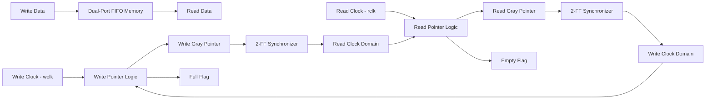
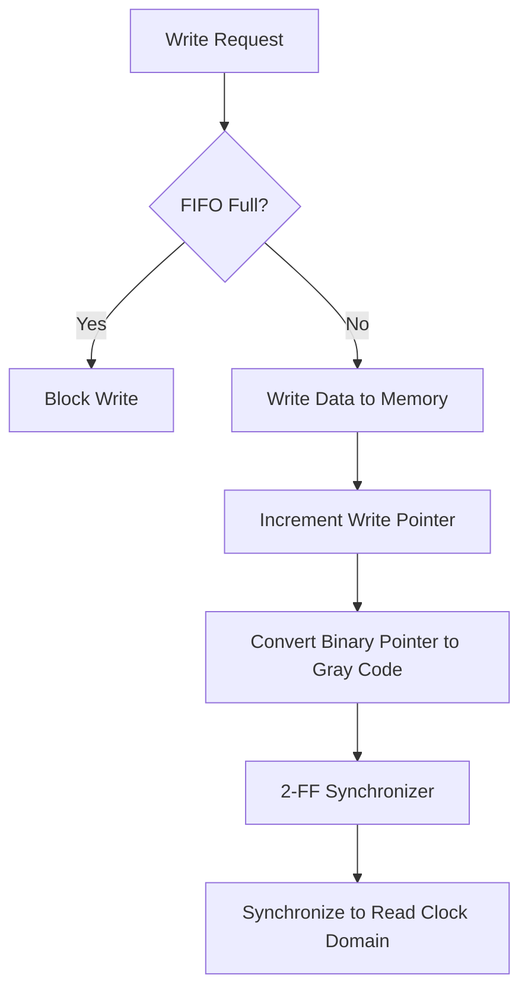
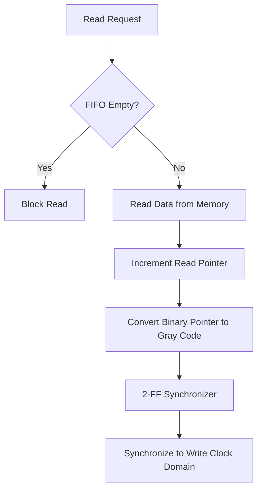
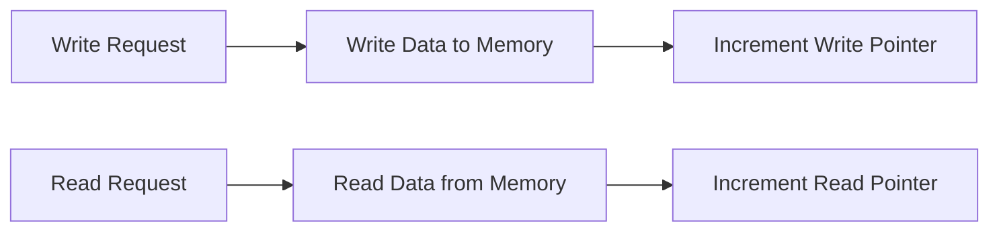
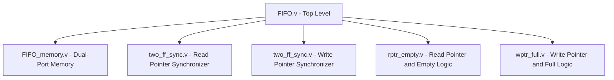
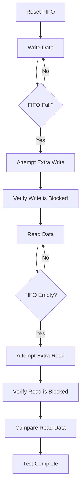

# Asynchronous FIFO

## Introduction

FIFO stands for **First-In, First-Out**. It is a data structure or buffer in which the first data element added is the first one to be removed.

An **Asynchronous FIFO (Async FIFO)** is a FIFO buffer in which the read and write operations are controlled by **independent clock domains**. The write operation and read operation are driven by different clocks that are not synchronized with each other.

Asynchronous FIFOs are commonly used for safely transferring data between different clock domains.

### Applications

- **Clock Domain Crossing (CDC):** Transfer data between logic operating at different clock frequencies.
- **SoC Communication:** Interface between modules operating in different clock domains.
- **Data Buffering:** Handle differences between producer and consumer data rates.
- **FPGA/ASIC Designs:** Provide reliable data transfer between asynchronous subsystems.

---

## Design Overview

The asynchronous FIFO consists of:

- Dual-port memory
- Write pointer logic
- Read pointer logic
- Gray-code pointer conversion
- Clock-domain synchronizers
- Full and empty flag generation

The write and read sides operate independently using separate clocks.



---

## Working Principle

### Write Operation

The write side operates using the `wclk` clock.



When a valid write request is received and the FIFO is **not full**, the input data is stored in the memory location pointed to by the binary write address.

The write pointer is then incremented. The updated binary pointer is converted into **Gray code** before being transferred to the read clock domain.

If the FIFO is full, additional write operations are blocked.

### Read Operation

The read side operates using the `rclk` clock.



When a valid read request is received and the FIFO is **not empty**, data is read from the memory location pointed to by the read address.

The read pointer is then incremented and converted into Gray code before being synchronized into the write clock domain.

If the FIFO is empty, additional read operations are blocked.

---

## Read and Write Operations

In an asynchronous FIFO, the read and write operations are managed by separate clock domains.

The **write pointer** points to the next memory location where data will be written. During a write operation, data is stored at the location pointed to by the write pointer, after which the write pointer is incremented.

Similarly, the **read pointer** points to the current memory location from which data will be read. During a read operation, data is retrieved from the location pointed to by the read pointer, after which the read pointer is incremented.

On reset, both pointers are initialized to zero.



---

## Full, Empty and Wrapping Conditions

The FIFO uses the read and write pointers to determine whether the buffer is **empty** or **full**.

### Empty Condition

The FIFO is empty when the read pointer and write pointer represent the same location.

This condition can occur:

- After reset when both pointers are zero.
- When the read pointer catches up with the write pointer after all stored data has been read.

```text
Read Pointer = Write Pointer
        |
        v
   FIFO EMPTY
```

### Full Condition

The FIFO is full when the write pointer has wrapped around and caught up with the read pointer.

The pointer contains an additional **Most Significant Bit (MSB)** to distinguish between the full and empty conditions.

```text
+-----+----------------+
| MSB | Memory Address |
+-----+----------------+
```

When the write pointer reaches the final FIFO address and increments again, the address bits wrap back to zero while the additional MSB changes.

If the corresponding pointer MSBs indicate that the write pointer has completed one additional wrap-around relative to the read pointer, the FIFO is considered full.

### Wrapping Condition

When a pointer reaches the final FIFO memory address, the address bits wrap around to zero and the extra MSB toggles.


The additional pointer bit allows the design to distinguish between:

- Both pointers pointing to the same location → **FIFO Empty**
- Write pointer being one complete buffer ahead → **FIFO Full**

---

## Gray Code Counter

Gray code counters are used in asynchronous FIFO designs because **only one bit changes between consecutive Gray-code values**.

This is important when transferring a multi-bit pointer between different clock domains.

If a binary counter changes from one value to another, multiple bits may change simultaneously.

For example:

```text
Binary:

0111 -> 1000
```

Multiple bits change at the same time.

In Gray code:

```text
Gray:

0100 -> 1100
```

Only one bit changes between consecutive values.

Therefore, Gray-coded pointers reduce the risk of receiving an inconsistent multi-bit value when crossing clock domains.

```text
Binary Pointer
      |
      v
Gray Code Conversion
      |
      v
2-FF Synchronizer
      |
      v
Other Clock Domain
```

---

## Clock Domain Crossing

The asynchronous FIFO contains two independent clock domains:

```text
Write Clock Domain                    Read Clock Domain

     wclk                                  rclk
      |                                      |
      v                                      v
Write Pointer                           Read Pointer
      |                                      |
      v                                      v
Write Gray Pointer                       Read Gray Pointer
      |                                      |
      |                                      |
      +-------> 2-FF Synchronizer <----------+
```

The Gray-coded write pointer is synchronized into the read clock domain.

Similarly, the Gray-coded read pointer is synchronized into the write clock domain.

The synchronization is implemented using a **two-flip-flop synchronizer**.

---

## Signals Definition

| Signal | Description |
|---|---|
| `wclk` | Write clock signal |
| `rclk` | Read clock signal |
| `wdata` | Write data input |
| `rdata` | Read data output |
| `wclk_en` | Write clock enable controlling the write operation |
| `wptr` | Write pointer in Gray-code representation |
| `rptr` | Read pointer in Gray-code representation |
| `winc` | Write pointer increment control |
| `rinc` | Read pointer increment control |
| `waddr` | Binary write pointer address |
| `raddr` | Binary read pointer address |
| `wfull` | FIFO full flag |
| `rempty` | FIFO empty flag |
| `wrst_n` | Active-low asynchronous reset for the write-side logic |
| `rrst_n` | Active-low asynchronous reset for the read-side logic |
| `w_rptr` | Read pointer synchronized into the `wclk` domain |
| `r_wptr` | Write pointer synchronized into the `rclk` domain |

---

## Design Architecture

The design is divided into five main RTL modules.



### 1. `FIFO.v`

`FIFO.v` is the top-level wrapper module.

It connects the memory, read pointer logic, write pointer logic, and clock-domain synchronizers.

The module provides the complete asynchronous FIFO interface and coordinates the interaction between the read and write clock domains.

### 2. `FIFO_memory.v`

`FIFO_memory.v` contains the FIFO memory array.

The memory supports independent read and write operations using separate clocks and addresses.

The memory depth is determined by:

```text
Depth = 2^ADDR_SIZE
```

The write side stores data on the rising edge of `wclk` when the write operation is enabled and the FIFO is not full.

### 3. `two_ff_sync.v`

`two_ff_sync.v` implements a two-flip-flop synchronizer.

The module contains two flip-flops:

```text
Input
  |
  v
+----+
| Q1 |
+----+
  |
  v
+----+
| Q2 |
+----+
  |
  v
Output
```

The first flip-flop samples the asynchronous input, while the second flip-flop provides the synchronized output to the destination clock domain.

Two instances of this module are used:

- Read pointer → Write clock domain
- Write pointer → Read clock domain

### 4. `rptr_empty.v`

`rptr_empty.v` implements the read pointer logic and generates the FIFO empty flag.

The module:

- Maintains the binary read pointer.
- Generates the Gray-coded read pointer.
- Generates the read address.
- Updates the pointer according to the read request.
- Generates the `rempty` signal.

The FIFO is considered empty when the next read pointer matches the synchronized write pointer.

### 5. `wptr_full.v`

`wptr_full.v` implements the write pointer logic and generates the FIFO full flag.

The module:

- Maintains the binary write pointer.
- Generates the Gray-coded write pointer.
- Generates the write address.
- Updates the pointer according to the write request.
- Generates the `wfull` signal.

The FIFO is considered full when the next write pointer reaches the appropriate full condition relative to the synchronized read pointer.

---

## Project File Structure

```text
Asynchronous-FIFO/
|
+-- README.md
|
+-- RTL/
|   +-- FIFO.v
|   +-- FIFO_memory.v
|   +-- two_ff_sync.v
|   +-- rptr_empty.v
|   +-- wptr_full.v
|
+-- Testbench/
    +-- FIFO_tb.v
```

---

## Parameterization

The FIFO is designed to support configurable data and address sizes.

Typical parameters include:

```verilog
parameter DATA_SIZE = 8;
parameter ADDR_SIZE = 4;
```

The FIFO memory depth is:

```text
FIFO Depth = 2^ADDR_SIZE
```

For example:

```text
ADDR_SIZE = 4

Depth = 2^4
      = 16 locations
```

The parameterized design allows the same RTL architecture to be reused for different FIFO sizes.

---

## Testbench Case Implementation

The asynchronous FIFO is verified using a dedicated testbench.

The testbench performs the following major test cases.

### Test Case 1 — Normal Write and Read

```text
Write Data
    |
    v
  FIFO
    |
    v
Read Data
    |
    v
Compare with Original Data
```

Data is written into the FIFO and subsequently read back.

The received data is compared with the original transmitted data to verify correct storage and retrieval.

### Test Case 2 — FIFO Full Condition

The FIFO is filled until the `wfull` flag becomes active.

An additional write operation is then attempted.

Expected behavior:

```text
FIFO Full = 1
     |
     v
Additional Write
     |
     v
Write Blocked
```

This verifies that the FIFO does not accept additional data when it is full.

### Test Case 3 — FIFO Empty Condition

All available data is read from the FIFO until the `rempty` flag becomes active.

An additional read operation is then attempted.

Expected behavior:

```text
FIFO Empty = 1
      |
      v
Additional Read
      |
      v
Read Blocked
```

This verifies that the FIFO does not perform invalid reads when no data is available.

---

## Verification Flow



---

## Results

The asynchronous FIFO was tested using a dedicated testbench.

The following key behaviors were verified:

### Correct Data Storage and Retrieval

The FIFO correctly stored written data and returned the same data during read operations.

Multiple data patterns were tested to verify correct FIFO ordering.

### Full and Empty Conditions

The FIFO correctly generated the `wfull` and `rempty` status signals.

When the FIFO was full:

```text
wfull = 1
```

Additional write operations were prevented.

When the FIFO was empty:

```text
rempty = 1
```

Additional read operations were prevented.

### Clock Domain Operation

The read and write sides operate using independent clocks, demonstrating the intended asynchronous FIFO architecture.

---

## Key Design Concepts

This project demonstrates several important RTL and VLSI concepts:

- Asynchronous FIFO architecture
- Clock Domain Crossing (CDC)
- Dual-clock operation
- Binary counters
- Gray-code counters
- Pointer synchronization
- Two-flip-flop synchronizers
- Full and empty flag generation
- Dual-port memory
- Parameterized RTL design
- RTL verification and testbench development

---

## Limitations

Functional simulation can verify the logical behavior of the FIFO, but it cannot completely reproduce physical **metastability** behavior in actual hardware.

Metastability is a physical phenomenon that can occur when signals cross clock domains near setup and hold-time boundaries.

The design therefore relies on CDC techniques such as:

- Gray-coded pointers
- Two-flip-flop synchronizers
- Proper clock-domain separation

Actual hardware implementation would require further verification using synthesis, static timing analysis, CDC analysis, and hardware testing.

---

## Future Improvements

Possible future improvements include:

- FPGA implementation and hardware validation.
- ASIC synthesis and timing analysis.
- Dedicated CDC verification.
- Formal verification of full and empty conditions.
- Randomized stress testing with different clock frequencies.
- Testing different FIFO depths and data widths.
- Power and area optimization.
- Further timing analysis under different clock-domain relationships.

---

## Conclusion

The asynchronous FIFO demonstrates reliable data storage and transfer between two independent clock domains.

The design uses **Gray-code pointers** to safely communicate pointer information across clock domains and **two-flip-flop synchronizers** to reduce metastability propagation.

The full and empty conditions are generated using synchronized pointer information, while the dual-port memory allows independent read and write operations.

The testbench verifies normal data transfer as well as FIFO full and empty boundary conditions.

Overall, this project demonstrates practical concepts in **RTL Design, Digital Design, Clock Domain Crossing (CDC), Memory Design, and VLSI Design**.
